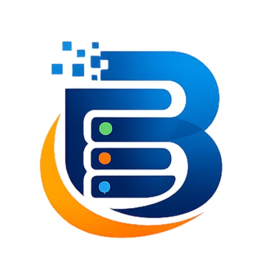

<div align="center">
  

  # BanglaHost Official Website

  **The ultimate local web development ecosystem for Windows.**  
  [](https://mohammad-sheikh-shahinur-rahman.github.io/BanglaHost-Website/)
  [](LICENSE)
  
  [**View Live Website**](https://mohammad-sheikh-shahinur-rahman.github.io/BanglaHost-Website/) • 
  [**Download App**](https://sourceforge.net/projects/banglahost-local-server/files/BanglaHost-Setup-1.5.1.0.exe/download)
</div>

---

## 🌐 About This Repository

This repository contains the source code for the official landing page and documentation website of **BanglaHost**. It is a static, highly optimized website built to showcase the powerful features of the BanglaHost Windows Application.

### 🌟 Features of the Website
- **Fully Responsive & Modern Design:** Designed with a clean, WinUI 3 inspired aesthetic.
- **Bilingual Support:** Available in both English (`index.html`) and Bengali (`index-bn.html`).
- **Enterprise SEO:** Configured with advanced JSON-LD Schema markup, Open Graph tags, and Twitter cards for perfect social sharing.
- **Fast Performance:** Pure HTML, CSS, and Vanilla JavaScript. No heavy frameworks.
- **Microsoft Store Integrated:** Uses the official `<ms-store-badge>` web component.

## 💻 Tech Stack
- **HTML5** (Semantic & Accessible)
- **CSS3** (Flexbox, Grid, CSS Variables, Animations)
- **JavaScript** (Vanilla JS for smooth scrolling & interactivity)
- **FontAwesome** (Icons)
- **Google Fonts** (Inter & Hind Siliguri)

## 🚀 Running Locally

Since this is a static website, you don't need any complex build tools to run it.

1. Clone the repository:
   ```bash
   git clone https://github.com/mohammad-sheikh-shahinur-rahman/BanglaHost-Website.git
   ```
2. Navigate into the directory:
   ```bash
   cd BanglaHost-Website
   ```
3. Open `index.html` in your favorite browser, or use a tool like Live Server in VS Code.

## 🖼️ Preview


## 🔗 Related Links
- **Main App Repository:** (Your main BanglaHost app repo link goes here)
- **Developer:** [Mohammad Sheikh Shahinur Rahman](https://shahinurrahman.com/)
- **LinkedIn:** [Mohammad Sheikh Shahinur Rahman](https://www.linkedin.com/in/mohammad-sheikh-shahinur-rahman/)

## 📄 License
This project is licensed under the MIT License - see the LICENSE file for details.
